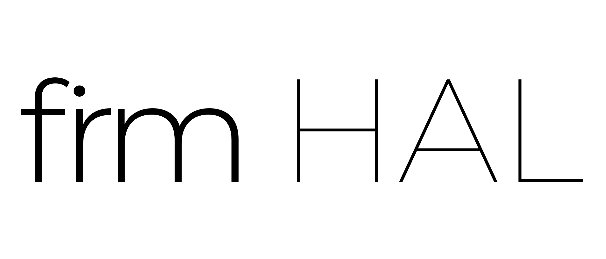

firm is an object-oriented C++ hardware abstraction layer (HAL) and collection of device drivers for bare-metal embedded software targeted at microcontrollers.

firm is developed by [sehrgute.software](https://github.com/sehrgutesoftware) and can be commercially licensed.

The following platforms are currently supported:
- ATXMega (Microchip/Atmel)
- RP2040 (Raspberry Pi)
